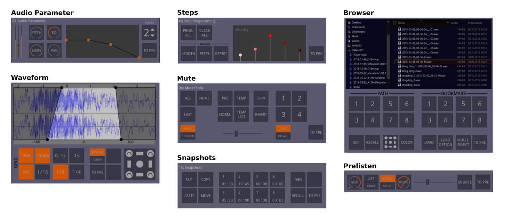
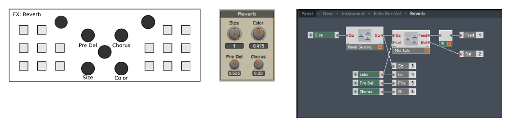
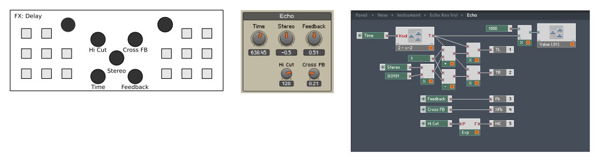
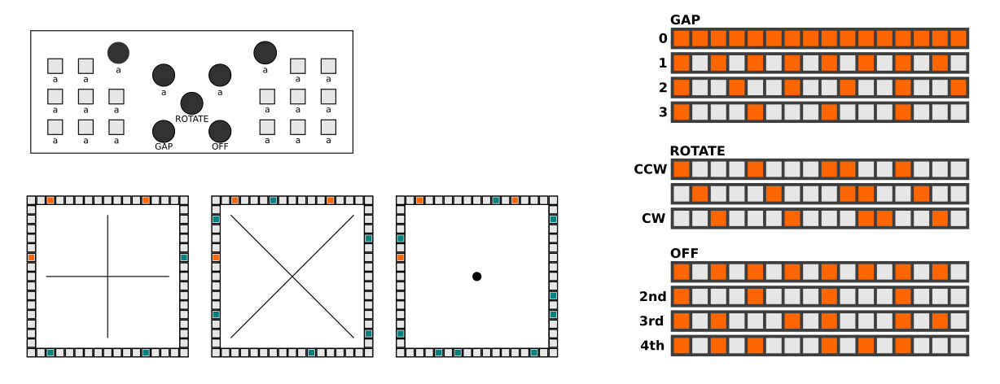
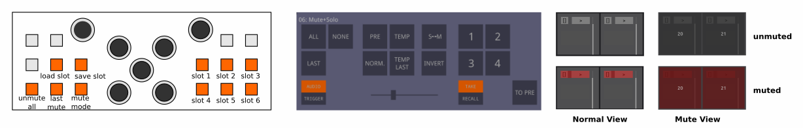

# Mosaik Manual

Mosaik combines techniques from sampling, stepsequcencing, live/jamming, looping, DJing and dubmixing to always give you full overview and control over your beats.

- Mosaik - made for stage
- Mosaik is a rhythm instrument, optimized for live beat programming. 
- sample sequence instrument

## Overview
- sampling
- stepsequcencing
- live/jamming: mute, mixer
- looping
- DJing: prelisten and crossfade
- dubmixing: mixer with fx-return on fadern

## Concepts
- starts with empty tiles and steps and at random speed (60..180)
- prelisten
- automatic session recording and live sampling
- groups (mixer channel, mute, selection, steps?)
- undo
- load multiple tiles (no load/save)
- is normally in playmode (ext. midi?)

## Hardware
- 10inch touch display
- 64 step sequencer
- 16 software defined buttons
- 7 software defined encoder 

## UI Overview (obsolete)

### Quick Start Guide / Workflow
- 1) select a tile on the tile grid (4)
- 2) browse samples (2) via the controller and prelisten via headphones, the waveform will be shown in the Waveform Window (3)
- 3) load the selected sample to the selected tile via the controller,
- 4) set steps on the stepsequencer of the controller (the sequence can be prelisten via headphones)
- 5) use the fadelope to change the sample length (start, fade-in, fade-out, end) (3)
- 6) repeat the previous steps to get a full beat
- 7) change to mute overlay via the controller
    - select the tiles to be muted on the tile grid (4)
    - press unmute all (controller) to hear the full
     sequence again
    - press last mute to go back to the last mute states 

## GUI
- tile grid, toolboxes
- dubmixer (channel, main)

## selection frames

## Tiles
- Sample Player
- Volume, Pan
- VU meter
- Envelope, Hitpoint
- Pitch, Playdirection 
- FX: Distortion, Filter

- a) tile not playing
- b) tile triggered
- c) tile starts playing
- d) tile is playing
- e) tile is not playing
- f) tile with envelope, only envelope is shown, additional time for full sample length

## Toolboxes
a conceptional overview of the toolboxes (obsolete)

## Software Defined HWUI

## Audio Parameter
- Volume
- Pan
- Play Direction
- Pitch
- filter and distortion curve display 

## Audio Signal Flow

### tiles

### main

## Waveform / Envelope
- Envelope: Start, FadeIn, FadeOut, End
- move envelope
- Hitpoint
- timeline
- barline

## FX: Filter 
### 2P HiPass
- cutoff
- resonance

### Peak EQ (BP)
- gain
- frequency
- bandwidth 

### 2P LoPass
- cutoff
- resonance

## FX: Distortion
### C15 Shaper (Analog)
- Gain
- Fold
- Asymetry
### Quantize Down Sample (Digital)
- Step
- Offset
- Frequency/Sample Rate

## FX: Reverb
Return Fader
- Size
- Color
- Pre Delay
- Chorus

## FX: Delay 
Return Fader
- Time
- Stereo
- Feedback
- Hi Cut
- Cross FB

## StepWizzard
- set all
- clear all
- mirror
- invert 
- wizzard: rotate, gap, off 

## Mute
- unmute all
- last selection
- groups
- stepmute

## Snapshot
- slots: load, save

## Browser
- prelisten sample
- browse sample
- bookmark samples
- unload sample from tile
- waveform
- load multiple tiles
- pathes: load/save

## Prelisten
- headphones volume
- split or mixed
- swap left/right channel
- x-fade between main and pre

## Audio Recorder
- select source: line in, mic in
- level
- save recording to sample collection
- load recording to tile

## MIDI
- Key/Pad (Rootnote for tiles)
- Controller: (Motor) Fader, Potis
- MIDI Clock: internal, external
- MIDI learn/assign mode/overlay

## DMX
- metronom
- visualize beat/bar (counter)
- link led-spots to tiles (trigger, color)
- show multiple tiles/sequneces on led-matrix

## Manual
- shows the manual
- can be full page?

## Beat Book
- a way to store/learn rhythm pattern

## IO-Panel
- frontpanel left: Headphones Out, Vol-Poti, USB
- frontpanel right: Line In, Mic In + Poti
- backpanel left: Main Out, Phono In, MIDI-Clock (In/Out)
- backpanel right: Power In, Power Switch, USB (MSD, MIDI, WIFI, BT), Ethernet (Internet, Ableton-Link), HDMI (mirror/extend), DMX out

## Pages
- Main
- Manual
- Sample Organizer
- Audacity?
- Dubmixer?

